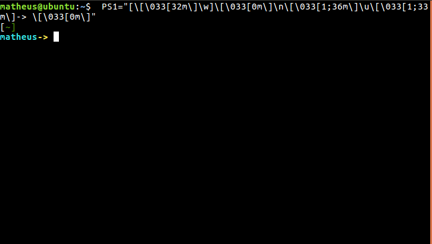

# scripts

Scripts that I wrote to install libraries, programs and command-line shortcuts automatically

## Scripts
- Bash prompt personalization

- Git alias
- OpenCV 3.4 complete build and installation with modules
- Zeegaree installation


## Usage
```
cd path/to/script
sh script-example.sh
```
